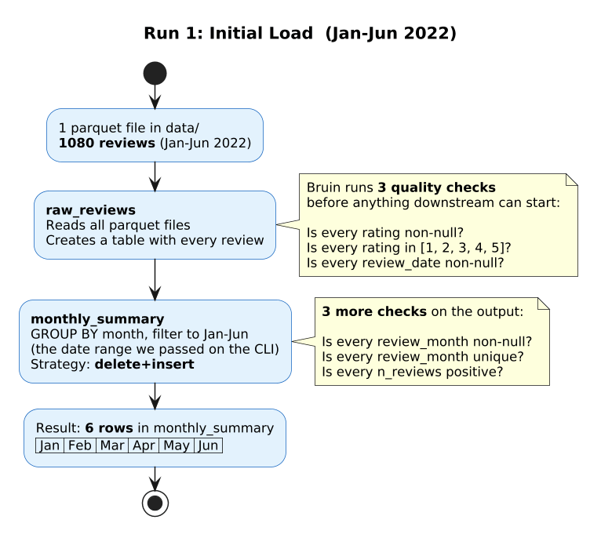
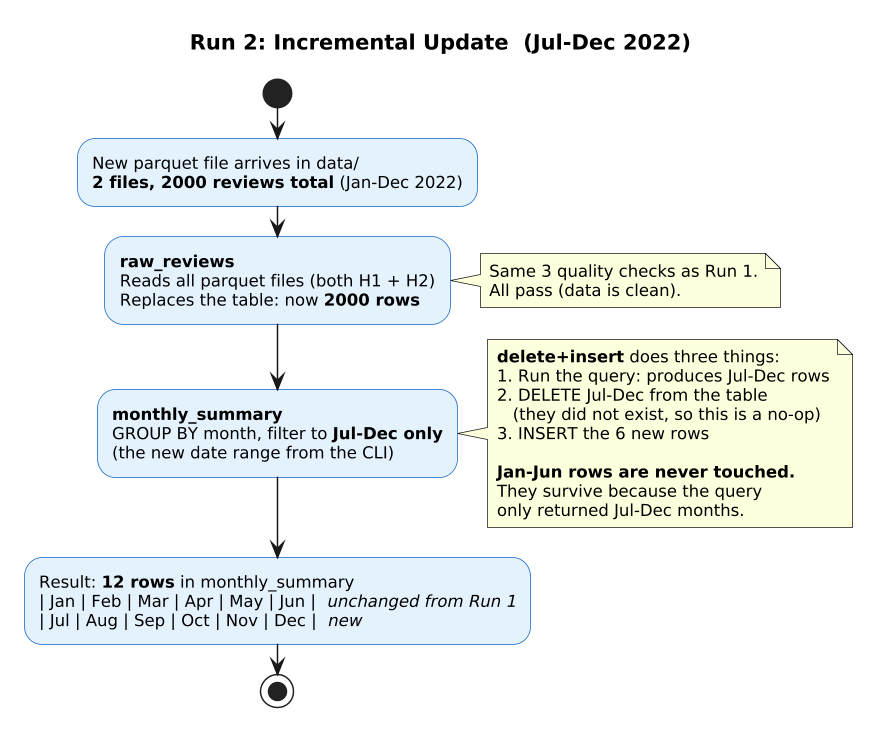
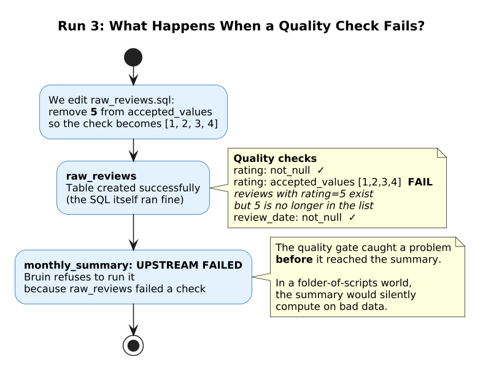

## Setup: EC2 gateway (~10 min before class)

You only need the EC2 instance for Part 1 (DuckDB). The EMR cluster is launched later, during the transition.

::: {.callout-note collapse="true" title="VS Code: what to install locally (one-time)"}
Install these extensions on your **laptop** (not on the remote machine). VS Code automatically installs its server-side component and forwards the Python/Jupyter extensions to the remote when you connect.

| Extension | ID | What it does |
|---|---|---|
| Remote - SSH | `ms-vscode-remote.remote-ssh` | Opens a full VS Code window on a remote machine over SSH. All file editing, terminal, and extensions run on the remote; only the UI runs locally. |
| Python | `ms-python.python` | Language support, linting, debugging. Auto-forwarded to the remote. |
| Jupyter | `ms-toolsai.jupyter` | Runs `# %%` cell blocks in `.py` files as interactive notebook cells. Needs a kernel on the remote (setup.sh registers one). |
:::

**Step 1.** Make sure your AWS session is active:

```bash
aws sso login --profile ilya-ubc-aws-student
```

**Step 2.** From your laptop, inside this repo, launch the gateway:

```bash
bash infra/create_gateway.sh
```

The script launches a `t3a.xlarge` (16 GB RAM) with the S3 instance profile and SSH security group attached. It waits for the instance to start and prints the public IP.

**Step 3.** Add the gateway to your `~/.ssh/config` (the script prints this block, paste it):

```
Host gateway
    HostName <public-ip-from-step-1>
    User ubuntu
    IdentityFile ~/mds/mds-ilya-ec2.pem
```

**Step 4.** SSH in via the alias, install git, clone the repo, and run setup:

```bash
ssh gateway
sudo apt-get update && sudo apt-get install -y git
git clone https://github.com/ilyamusabirov/525next-steps.git
cd 525next-steps/demos/sql-on-cluster
bash setup.sh
exit
```

`setup.sh` installs uv, syncs packages (duckdb, boto3, ipykernel), registers a Jupyter kernel "SQL Demo (uv)", and creates the `/tmp/duckdb` spill directory.

::: {.callout-note collapse="true" title="Alternative: copy scripts without git"}
If git is not available or you want to copy from your laptop:

**Option A: scp from laptop** (run from the repo directory on your laptop):

```bash
scp -r demos/sql-on-cluster gateway:~/525next-steps/demos/sql-on-cluster
ssh gateway "cd 525next-steps/demos/sql-on-cluster && bash setup.sh"
```

**Option B: download from S3** (if you uploaded the scripts earlier):

```bash
ssh gateway
aws s3 cp s3://dsci525-data-2026/scripts/ ~/525next-steps/demos/sql-on-cluster/ --recursive
cd 525next-steps/demos/sql-on-cluster && bash setup.sh
```
:::

**Step 5.** Connect VS Code via Remote SSH to `gateway`. Open the `~/525next-steps/demos/sql-on-cluster/` folder. Open `01_duckdb_s3.py`, select the "SQL Demo (uv)" kernel, run the first cell to verify.

::: {.callout-note collapse="true" title="First connection to a new node: what happens on the remote"}
When VS Code connects to a new host for the first time, it:

1. Copies and starts `vscode-server` in `~/.vscode-server/` (~30s on first connect, cached after that)
2. Forwards the Python and Jupyter extensions to the remote automatically
3. Discovers Jupyter kernels registered on the remote (setup.sh registered "SQL Demo (uv)" via `ipykernel install`)

If the kernel picker is empty or shows the wrong Python, run on the remote terminal:

```bash
uv run python -m ipykernel install --user --name sql-demo --display-name "SQL Demo (uv)"
```

Then reload the VS Code window (Cmd+Shift+P > "Reload Window").
:::


## Part 1: DuckDB on EC2 (~20 min) {#part1}

::: {.callout-note collapse="true" title="Before: framing for students"}
This is a **data lake** setup: files on S3, no database, schema applied at query time. In a warehouse you'd write `SELECT * FROM reviews`. Here you write `read_parquet('s3://...')` because the parquet files *are* the data. DuckDB, Spark, and Trino are all different engines that read those same files. We start with the simplest one.
:::

### Script: `01_duckdb_s3.py`

Open in VS Code. Run each cell.

#### Setup cell

::: {.callout-note collapse="true" title="Before: what we're configuring"}
Three settings + one credential line = full SQL on 22.5 GB of S3 parquet. No cluster, no YARN, no HDFS. The memory limit (4 GB) and thread count (4) are intentionally low: we want to show where DuckDB hits the wall later.
:::

```python
conn = duckdb.connect()
conn.execute("SET memory_limit = '4GB';")
conn.execute("SET threads = 4;")
conn.execute("SET temp_directory = '/tmp/duckdb';")

conn.execute("""
    CREATE SECRET (
        TYPE s3, PROVIDER credential_chain, REGION 'ca-central-1'
    )
""")
```

::: {.callout-tip collapse="true" title="After: what to highlight"}
`credential_chain` checks (in order): env vars, `~/.aws/credentials`, instance metadata. On EC2 with an instance profile, it picks up the role's temporary credentials automatically. No access keys in code.
:::

#### Query 1: Category summary (~4s)

::: {.callout-note collapse="true" title="Before: what we're doing"}
For each product category, count reviews and compute the average rating. Only 4 categories, so the hash table is tiny (~400 bytes). This query is bottlenecked by S3 read speed, not computation.
:::

```python
SELECT category, COUNT(*) AS n_reviews,
       ROUND(AVG(rating), 2) AS avg_rating
FROM read_parquet('{S3}', hive_partitioning=true)
GROUP BY category
ORDER BY n_reviews DESC
```

::: {.callout-tip collapse="true" title="After: results and performance"}
Low-cardinality GROUP BY: the hash table has **4 entries** (~400 bytes). The time (~4s) is almost entirely S3 I/O: streaming 22.5 GB of parquet.
:::

#### Query 2: Filter + sort with LIMIT (~14s)

::: {.callout-note collapse="true" title="Before: what we're doing"}
Find the 20 most-helpful reviews across all 207M rows. DuckDB does NOT sort all 49M qualifying rows: it keeps a small heap of size 20 and only inserts a row if it beats the current minimum.
:::

```python
SELECT asin, title, helpful_vote, rating
FROM read_parquet('{S3}', hive_partitioning=true)
WHERE helpful_vote > 0
ORDER BY helpful_vote DESC
LIMIT 20
```

::: {.callout-tip collapse="true" title="After: results and performance"}
Top-k optimization: DuckDB tracks the top 20 in a **heap**, never sorts all 49M qualifying rows. O(n log k) with constant memory, not O(n log n) full sort.
:::

#### Query 3: Cross-category join (~19s)

::: {.callout-note collapse="true" title="Before: what we're doing"}
How many users gave 4+ star reviews in BOTH Electronics and Books? DuckDB builds two sets of distinct user IDs (one per category), then hash-joins them. Hive partitioning means it only reads those two category folders from S3, skipping the rest entirely.
:::

```python
SELECT COUNT(*) AS shared_users FROM (
    SELECT DISTINCT user_id
    FROM ... WHERE category = 'Electronics' AND rating >= 4
) e JOIN (
    SELECT DISTINCT user_id
    FROM ... WHERE category = 'Books' AND rating >= 4
) b USING (user_id)
```

::: {.callout-tip collapse="true" title="After: results and performance"}
Hive partitioning: DuckDB only reads `Electronics/` and `Books/` partitions, skips the rest. The two DISTINCT sets (~30M + ~20M user IDs) fit in 4 GB.

**Key message:** DuckDB streams 22.5 GB through 4 GB of RAM. The data never fully loads. The bottleneck is not data size.
:::


### Script: `02_duckdb_limits.py`

#### GROUP BY 10M products (~52s)

::: {.callout-note collapse="true" title="Before: what we're doing"}
For each of ~10 million products, count reviews and average rating. DuckDB must build a hash table with one entry per product. This is the first query where the intermediate structure (hash table) is large enough to matter.
:::

```python
SELECT parent_asin, COUNT(*) AS n_reviews, ROUND(AVG(rating), 2) AS avg_rating
FROM read_parquet('{S3}', hive_partitioning=true)
GROUP BY parent_asin
ORDER BY n_reviews DESC LIMIT 20
```

::: {.callout-tip collapse="true" title="After: results and performance"}
Walk through the hash table math on the board:

| Component | Bytes |
|---|---|
| Key (`parent_asin` string, ~10 chars) | ~26 |
| Hash value | 8 |
| COUNT + SUM + COUNT for AVG | 24 |
| Pointer / metadata | 16 |
| **Total per entry** | **~100** |

10M entries x 100 bytes = ~1 GB. With 4 thread-local partitions: 250 MB each. Fits in 4 GB.
:::

#### GROUP BY + WINDOW (~74s)

::: {.callout-note collapse="true" title="Before: what we're doing"}
Find the top 10 most-reviewed products in each category. This needs two expensive operators back to back: a hash table for GROUP BY, then a window buffer for ROW_NUMBER. Both compete for the same 4 GB memory budget.
:::

::: {.callout-tip collapse="true" title="After: results and performance"}
Still fits, but pushing the limit. Two memory-intensive operators back to back: hash table (~1 GB) + window sort buffer. DuckDB is running close to its 4 GB ceiling.
:::

#### Boundary discussion

::: {.callout-important icon="false" title="The boundary question (do on the board)"}
Ask the class: what if we GROUP BY `user_id` instead of `parent_asin`?

```
10M products x 100 bytes = ~1 GB  -> fits in 4 GB
50M users    x 100 bytes = ~5 GB  -> ???

With 4 thread-local partitions:
  50M / 4 = 12.5M entries/thread x 100 B = 1.25 GB/thread
  4 threads x 1.25 GB = 5 GB minimum -> exceeds 4 GB limit
```

**Prediction**: at 4 GB with no spill, this will OOM. Let them say it before you run it.
:::

#### What if we disable spill-to-disk?

::: {.callout-note icon="false" title="Why we disable spill-to-disk first"}
The cell disables `temp_directory` before running the query. This forces DuckDB to fit the entire hash table in RAM. At 4 GB it cannot. Without this line, DuckDB would spill to disk and succeed (we show that next).
:::

Run the cell. Let it fail. Read the error message together: "~50M unique users x ~100 bytes = ~5 GB hash table, memory_limit = 4 GB, spill disabled."

#### Rescue: 12 GB, 4 threads, spill-to-disk

::: {.callout-note collapse="true" title="Before: what we're trying"}
Re-enable spill-to-disk and raise memory to 12 GB (75% of the 16 GB machine). Keep 4 threads: this is the honest config for this instance.
:::

```python
conn.execute("SET temp_directory = '/tmp/duckdb';")   # re-enable spill
conn.execute("SET memory_limit = '12GB';")
```

::: {.callout-tip collapse="true" title="After: results and performance"}
Succeeds in ~61 seconds. DuckDB CAN handle 50M groups on one machine, but uses 75% of available RAM for one query.

**Three walls of scaling up:**

- **Memory ceiling**: 75% of this machine for one query. A bigger hash table may not fit even with 16 GB.
- **CPU bound**: 4 threads on a t3a.xlarge. A second machine's CPUs cannot help.
- **Network throughput**: one machine's NIC reads all 22.5 GB from S3.

**Transition:** "DuckDB finishes, but the machine is near its limits. Same SQL, same data: let's distribute the work across a cluster."
:::

::: {.callout-note collapse="true" title="Scale up vs scale out: when does a cluster beat a bigger machine?"}

### What the numbers actually show

The demo compares DuckDB on a **t3a.xlarge** (4 vCPU, 16 GB, \$0.15/hr) against SparkSQL on a **3-node EMR cluster** (12 vCPU total, ~48 GB total, \$0.71/hr). Two things differ at once: **memory** and **CPU cores**.

| Resource | DuckDB (demo) | DuckDB (default) | SparkSQL (3-node) |
|---|---|---|---|
| vCPU | 4 | 4 | 8 effective (2 core nodes x 4) |
| Usable memory | 4 GB (constrained) | 12 GB | ~20 GB across executors |
| S3 read bandwidth | 1 network connection | 1 network connection | 3 network connections |
| Cost | \$0.15/hr | \$0.15/hr | \$0.71/hr |

**Where more memory helps (but more CPU doesn't):** GROUP BY + WINDOW goes from 62s (4 GB, spilling) to 22s (12 GB, no spill) on the same 4 vCPU. Spark at 27s is slower than DuckDB at 12 GB despite having 2x the cores. The bottleneck was disk spill, not CPU.

**Where more CPU helps (but more memory doesn't):** Category summary goes from 18s (4 GB) to 15s (12 GB) with extra memory, but Spark does it in 7s. The query is trivial compute: 4 hash table entries. The difference is S3 read parallelism: 8 cores across 3 parallel network connections fetch parquet files faster than 4 cores on 1.

**A fairer single-machine comparison** would be a t3a.2xlarge (8 vCPU, 32 GB, \$0.30/hr), which matches Spark's core count and has plenty of memory. DuckDB would likely beat Spark on every query at that price point. The cluster costs 2.4x more and only wins on raw I/O throughput.

### So when does a cluster earn its cost?

DuckDB on a t3a.2xlarge (8 vCPU, 32 GB RAM, \$0.30/hr) would handle every query in this demo. Benchmarks show DuckDB processing 1 TB on a 64 GB machine. Single-machine engines (DuckDB, Polars, DataFusion) barely existed five years ago. Back then, 22.5 GB of GROUP BY work required a cluster. Today it doesn't.

**Tradeoffs that favor distributed engines (Spark, Trino, Hadoop):**

1. **S3 read parallelism.** One machine has one network connection. Three nodes have three times the network throughput. For scan-heavy queries on hundreds of GB+, this is the first bottleneck you hit. More CPU on a single machine does not help here.
2. **Dataset size beyond ~1 to 10 TB.** Single-node engines handle 1 TB comfortably. Beyond 10 TB, one machine runs out of disk I/O regardless of RAM. Hadoop MapReduce was built for this scale; Spark improved on it with in-memory caching and DAG execution. Newer engines like [Daft](https://www.getdaft.io/) and [Ray](https://www.ray.io/) target similar scale for ML workloads.
3. **Fault tolerance.** If a DuckDB query fails 2 hours in, you start over. Spark's lineage lets another executor retry a failed task without restarting the job.
4. **Elastic fleet management.** EMR Spark can run task instances on Spot pricing and replace them when reclaimed. Scaling a single DuckDB machine up and down is harder to automate.
5. **Concurrent access.** DuckDB is single-process. Spark serves multiple users and queries through YARN resource management.
6. **ML and streaming.** DuckDB is SQL-only. Spark has MLlib, Structured Streaming, and GraphX. If your pipeline chains SQL into distributed training, Spark avoids a tool boundary.
7. **Spill-to-disk gaps.** Both DuckDB and Spark spill intermediates to disk when memory fills up. Both slow down when they do. But DuckDB's `list()` and `string_agg()` can't spill at all, and multiple blocking operators in one query can still OOM. Spark pools disk across nodes and retries failed tasks.

### The distributed SQL landscape

**If you want DuckDB's SQL on a cluster**, Trino does exactly that: distributed SQL execution with a coordinator/worker model, same columnar engine philosophy. AWS Athena runs Trino serverlessly, so the cluster is not even your responsibility. MotherDuck offers hosted DuckDB with similar goals.

### Bottom line

For ad-hoc analytics up to a few hundred GB, DuckDB on one machine is faster, cheaper, and simpler. A bigger machine (\$0.30/hr) beats a cluster (\$0.71/hr) at this scale. The cluster pays for itself at TB+ scale, in production pipelines that need fault tolerance, or when multiple users share the same compute.

Sources: [DuckDB Memory Management](https://duckdb.org/2024/07/09/memory-management), [Running DuckDB at 10 TB](https://datamonkeysite.com/2025/10/19/running-duckdb-at-10-tb-scale/), [Should You Ditch Spark?](https://milescole.dev/data-engineering/2024/12/12/Should-You-Ditch-Spark-DuckDB-Polars.html), [Spark Disk Spill](https://towardsdatascience.com/memory-management-in-apache-spark-disk-spill-59385256b68c/), [Daft vs Ray Data](https://dev.to/yks/daft-vs-ray-data-a-comprehensive-comparison-for-multimodal-data-processing-3686)
:::


## Launch EMR (~1 min to run, ~8 min to provision) {#launch-emr}

Run this from your **laptop** while transitioning to Part 2. The cluster takes ~8 minutes to reach WAITING state, so launch it now and talk through the architecture while it provisions.

**Step 1.** Make sure your AWS session is active:

```bash
aws sso login --profile ilya-ubc-aws-student
```

**Step 2.** Launch the cluster (from the repo directory on your laptop):

```bash
bash infra/create_spark_cluster.sh
```

The script uploads the bootstrap (installs numpy + git on all nodes), auto-discovers public subnets, creates a 3-node EMR cluster (1 primary + 2 core, `m6a.xlarge`), waits for it to reach WAITING state (~8 min), and prints the private IP and SSH config block.

**Step 3.** Add the EMR primary to your `~/.ssh/config` (the script prints this block, paste it):

```
Host emr-primary
    HostName <private-ip-from-script-output>
    User hadoop
    IdentityFile ~/mds/mds-ilya-ec2.pem
    ProxyJump gateway
    LocalForward 4040 localhost:4040
    LocalForward 18080 localhost:18080
    LocalForward 8088 localhost:8088
```

The `LocalForward` lines tunnel the Spark UI (4040), History Server (18080), and YARN ResourceManager (8088) to your laptop automatically on connect.

**Step 4.** Verify the connection:

```bash
ssh emr-primary
```

::: {.callout-tip collapse="true" title="While the cluster provisions (~8 min)"}
Use this time to show the [infrastructure overview diagram](infra.qmd#architecture): VS Code on laptop connects to the Gateway EC2 via SSH, the gateway jumps to the EMR primary node via ProxyJump within the VPC, and the cluster reads from S3.
:::


## Part 2: SparkSQL on EMR (~20 min) {#part2}

**Step 1.** Clone the repo on the EMR primary node (git is installed by the bootstrap action):

```bash
ssh emr-primary
git clone https://github.com/ilyamusabirov/525next-steps.git
cd 525next-steps/demos/sql-on-cluster
```

::: {.callout-note collapse="true" title="Alternative: copy scripts without git"}
**Option A: scp from laptop** (uses ProxyJump through gateway):

```bash
scp -o ProxyJump=gateway demos/sql-on-cluster/03_spark_sql.py hadoop@<emr-primary-dns>:~/
scp -o ProxyJump=gateway demos/sql-on-cluster/04_spark_ml.py hadoop@<emr-primary-dns>:~/
scp -o ProxyJump=gateway demos/sql-on-cluster/05_spark_fail.py hadoop@<emr-primary-dns>:~/
```

**Option B: download from S3** (EMR nodes have S3 access via IAM role):

```bash
ssh emr-primary
aws s3 cp s3://dsci525-data-2026/scripts/03_spark_sql.py ~/
```
:::

**Step 2.** Run the Spark scripts via `spark-submit`. Append `2>/dev/null` to suppress Spark's verbose INFO logs (they go to stderr) and see only your `print()` output.

```bash
spark-submit 03_spark_sql.py 2>/dev/null
```

### Script: `03_spark_sql.py`

#### Category summary: Spark ~7s vs DuckDB ~18s

::: {.callout-note collapse="true" title="Before: what we're doing"}
Same query as DuckDB Query 1: count reviews per category. Only 4 groups. Watch the timing: Spark is faster here despite the trivial compute, because it reads S3 with more parallelism (8 cores, 3 network connections).
:::

::: {.callout-tip collapse="true" title="After: results and performance"}
Spark is **faster** here (~7s vs ~18s) despite the trivial aggregation. The query has only 4 hash table entries: zero compute pressure. The difference is pure S3 read speed: 8 cores across 3 network connections vs 4 cores on 1 network connection. DuckDB at 12 GB is still ~15s: more memory doesn't help because the bottleneck is network, not spill.
:::

#### Filter + sort: Spark ~5s vs DuckDB ~8s

::: {.callout-note collapse="true" title="Before: what we're doing"}
Same top-20 most-helpful query. Spark distributes the top-k selection across executors, then merges the per-executor top-20 lists on the driver.
:::

::: {.callout-tip collapse="true" title="After: results and performance"}
Spark is faster here (~5s vs ~8s). More S3 read parallelism (8 executor cores vs 4 DuckDB threads). The top-k merge is trivial.
:::

#### GROUP BY 10M products: Spark ~32s vs DuckDB ~44s

::: {.callout-note collapse="true" title="Before: what we're doing"}
Same 10M-product aggregation. The hash table is distributed across executors, each holding a slice. 8 executor cores read S3 in parallel vs DuckDB's 4 threads on one machine.
:::

::: {.callout-tip collapse="true" title="After: results and performance"}
Spark is **faster** here. 8 executor cores (2 core nodes x 4 vCPU) read S3 in parallel, compared to DuckDB's 4 threads on one machine. SparkSQL also has more total memory (~20 GB across executors vs 4 GB).
:::

#### GROUP BY + WINDOW: Spark ~27s vs DuckDB ~62s

::: {.callout-note collapse="true" title="Before: what we're doing"}
Top 10 most-reviewed products per category. Two expensive operators: GROUP BY builds a distributed hash table, then ROW_NUMBER() runs a window sort on each category partition.
:::

::: {.callout-tip collapse="true" title="After: results and performance"}
DuckDB at 4 GB: ~62s (spilling). DuckDB at 12 GB: ~22s (no spill, matches Spark). Most of the DuckDB slowdown at 4 GB was spill-to-disk, not lack of parallelism.
:::

#### Cross-category join: Spark ~13s vs DuckDB ~14s

::: {.callout-note collapse="true" title="Before: what we're doing"}
Same DISTINCT + JOIN query. Spark builds two distributed DISTINCT sets, then hash-joins them across the cluster.
:::

::: {.callout-tip collapse="true" title="After: results and performance"}
Nearly identical (~13s vs ~14s). Both engines handle this well; the join itself is small.
:::

#### GROUP BY 50M users: where the cluster earns its keep

::: {.callout-note collapse="true" title="Before: what we're doing"}
~50M unique users. DuckDB handled this at 12 GB + spill in ~61 seconds, but it used 75% of the machine's RAM for one query. Spark distributes the hash table across executors: more total memory, more CPUs reading S3 in parallel, and no single machine near its limits.

**While this runs**: open Spark UI at `http://localhost:4040` (tunneled via LocalForward in SSH config).
:::

::: {.callout-tip collapse="true" title="After: results and performance"}
~32 seconds. Spark distributes the hash table across 3 nodes. Compare: DuckDB needed 61s and 75% of a 16 GB machine. Spark uses ~20 GB total across executors, with headroom to spare.

In the Spark UI:

- Show the **Stages** tab: active stage, task distribution across executors
- Show the **SQL** tab: physical plan with shuffle operators
- Point out **shuffle read/write** bytes: the redistribution cost for GROUP BY
:::

#### Comparison table

| Query | DuckDB (4 GB, low-resource) | DuckDB (12 GB, default) | SparkSQL (3-node) |
|---|---|---|---|
| Category summary | ~18s | ~15s | ~7s |
| Filter + sort (LIMIT 20) | ~8s | ~8s | ~5s |
| Cross-category join | ~14s | ~13s | ~13s |
| GROUP BY 10M products | ~44s | ~31s | ~32s |
| GROUP BY + WINDOW | ~62s | ~22s | ~27s |
| GROUP BY 50M users | OOM (no spill) | ~61s | ~32s |

Both DuckDB columns run on **1 machine, 4 vCPU**. Spark has **8 effective cores across 3 network connections**. Two confounds: memory and I/O parallelism. The "4 GB, low-resource" column is intentionally constrained: heavier queries spill to disk, making DuckDB look slower than it is. At 12 GB (default on a 16 GB machine), DuckDB matches or beats Spark on compute-heavy queries. Spark still wins on scan-heavy queries (category summary) thanks to 3x network throughput.

The 50M-user GROUP BY works at 12 GB with spill (~61s). The OOM in the demo happens only when we disable spill-to-disk to isolate the memory limit.

Cost: DuckDB on t3a.xlarge (4 vCPU, 16 GB) = \$0.15/hr. SparkSQL on 3-node EMR (12 vCPU, 48 GB) = \$0.71/hr. See the "Scale up vs scale out" callout above for the full analysis.

### Script: `04_spark_ml.py` (if time)

::: {.callout-note collapse="true" title="Before: what we're doing"}
SparkSQL for feature engineering chained with MLlib for training. Same cluster, same session, no intermediate files. Four steps in one pipeline:

1. **Feature engineering** (SparkSQL): aggregate 207M reviews into product-level features (review count, avg rating, rating spread, helpfulness, verified ratio, text length). Only products with 10+ reviews since 2020.
2. **Vector assembly** (MLlib): pack numeric columns into a single feature vector.
3. **Train** a Random Forest to predict avg_rating from product features. Training is distributed: each tree is built on a different executor.
4. **Evaluate**: RMSE on held-out test set, plus feature importances.
:::

```bash
spark-submit 04_spark_ml.py 2>/dev/null
```

::: {.callout-tip collapse="true" title="After: results and performance"}
SQL + ML in one pipeline, no intermediate files, no data movement between systems. This is the Spark differentiator: one cluster handles everything from raw S3 data to trained model.
:::

### Script: `05_spark_fail.py`

::: {.callout-note collapse="true" title="Before: what we're doing"}
Two intentional failures to show how to read Spark error messages and find logs. Do NOT suppress stderr here (`2>/dev/null`): the whole point is to see the error messages.

1. **Column typo** (`review_score` instead of `rating`): Spark catches this at query planning time before scanning any data.
2. **Executor OOM**: force all data to one partition with `REPARTITION(1)`, then `COLLECT_LIST` every review title per user. One executor gets everything, runs out of heap, crashes.
:::

```bash
spark-submit 05_spark_fail.py
```

::: {.callout-tip collapse="true" title="After: what to point out"}
**Failure 1:** The AnalysisException tells you exactly which column is missing. Look at driver stderr, Spark UI SQL tab.

**Failure 2:** Look at Spark UI Stages tab for the failed stage, executor logs for `OutOfMemoryError`.

| What happened | Where to look |
|---|---|
| Query syntax/schema error | Driver stderr, Spark UI SQL tab |
| Task OOM | Executor stderr, Spark UI Stages tab |
| Job stuck | YARN ResourceManager (port 8088) |
| Cluster terminated | EMR Console step logs |
:::


## Part 3: Transient cluster (~5 min, walkthrough) {#part3}

This can be a walkthrough without running the scripts.

### Show `infra/transient_step.sh`

::: {.callout-note collapse="true" title="Before: what we're showing"}
The batch pattern: submit a script, cluster starts, runs it, terminates. No SSH needed. `--auto-terminate` + `--steps` = fire and forget.
:::

::: {.callout-tip collapse="true" title="After: what to highlight"}
You pay only for compute time. Compare with the interactive cluster from Part 2: you pay for idle time while debugging.
:::

### Show `infra/batch_user_summary.py`

The DuckDB-OOM query (GROUP BY 50M users) as a standalone PySpark script that writes results to S3.


## Stretch: Trino (~5 min, if time) {#stretch}

### Show `infra/create_trino_cluster.sh`

::: {.callout-note collapse="true" title="Before: what we're showing"}
Third engine, same query. Trino runs outside YARN (its own coordinator/worker model), so it needs a dedicated cluster.
:::

::: {.callout-tip collapse="true" title="After: what to highlight"}
Pipeline execution: starts returning results before the full scan completes. Trino is to DuckDB what SparkSQL is to pandas: same SQL philosophy, distributed.
:::


## Part 4: Bruin pipeline (~10 min) {#part4}

::: {.callout-note collapse="true" title="Before: framing for students"}
"We just saw SQL engines of increasing power: DuckDB on one machine, SparkSQL on a cluster. But in practice, you don't run queries by hand every day. You build **pipelines**: sequences of steps with dependencies, quality checks, and incremental updates. Let's see what that looks like."

This runs on your **laptop** (no cloud needed). Source data is local parquet files.
:::

### Prerequisites

```bash
curl -LsSf https://getbruin.com/install/cli | sh    # Bruin CLI
# uv already installed (for generating test data)
```

### Show the pipeline structure

Open `demos/bruin-pipeline/` in VS Code. Walk through:

| File | What it does |
|---|---|
| `pipeline.yml` | Pipeline name (`review_analytics`), default DuckDB connection |
| `assets/raw_reviews.sql` | Ingest: reads ALL parquet in `data/*.parquet` (full refresh) |
| `assets/monthly_summary.sql` | Transform: GROUP BY month, **incremental** (`delete+insert`) |
| `data/` | Source parquet files (simulates S3 data drops) |

::: {.callout-important icon="false" title="Walk through the @bruin headers"}
Open `assets/raw_reviews.sql`:

```sql
/* @bruin
name: raw_reviews                   -- asset name
type: duckdb.sql                    -- SQL on DuckDB connection
materialization:
    type: table                     -- full refresh: CREATE OR REPLACE TABLE
columns:
  - name: rating
    checks:
      - name: accepted_values       -- rating must be 1-5
        value: [1, 2, 3, 4, 5]
@bruin */

SELECT * FROM read_parquet('data/*.parquet')   -- reads ALL files in data/
```

**What does `materialization: type: table` do?** Bruin wraps your SELECT in `CREATE TABLE raw_reviews AS ...` and runs it against the DuckDB database file (`food.db` on disk). DuckDB reads each parquet file, decompresses the row groups, converts the data into its own columnar format, and writes the result into `food.db` with lightweight compression (RLE, bit packing, dictionary encoding, etc.). After this, `food.db` contains a table called `raw_reviews`. The next asset queries that table, not the parquet files.

**Table = eager, View = lazy.** `type: table` reads and stores everything now. `type: view` saves only the query text (`CREATE VIEW ...`). No data is read until a downstream asset queries the view.

::: {.callout-note collapse="true" title="Where zero-copy does and does not apply"}
Reading from a DuckDB table is **not** zero-copy. DuckDB compresses data in its own storage format, so reading a table still means decompressing column segments from disk. It is faster than re-reading parquet (lighter compression, no format conversion, can decompress a few rows at a time), but it is still real I/O and CPU work.

**Where Arrow zero-copy does apply:** within a single Python process. When a Python asset calls `conn.execute("SELECT ...").pl()`, DuckDB streams its result to polars through Arrow buffers without extra copies. Polars wraps the Arrow memory directly. Pandas can receive numeric columns zero-copy with `pd.ArrowDtype`, but copies string columns (Arrow stores UTF-8, pandas uses Python objects).

**Where it does not apply:** between Bruin assets. Each asset opens `food.db`, reads, processes, writes, and closes. The handoff is always through the file on disk: compress → write → read → decompress. Arrow zero-copy does not help at this boundary.

In a longer pipeline, the pattern "materialize once as a table after ingesting an external format, then use views or further tables downstream" saves you from re-reading parquet/CSV on every step. The win is avoiding the parquet decompression and format conversion cost, not achieving zero-copy.
:::

Then `assets/monthly_summary.sql` (the incremental part):

```sql
/* @bruin
name: monthly_summary
type: duckdb.sql
materialization:
    type: table
    strategy: delete+insert         -- INCREMENTAL: only touch months in the result
    incremental_key: review_month   -- Bruin deletes+inserts by this column
depends:
  - raw_reviews                     -- runs after raw_reviews
@bruin */

SELECT
    DATE_TRUNC('month', review_date)::DATE AS review_month,
    COUNT(*) AS n_reviews, ...
FROM raw_reviews
WHERE review_date >= '{{ start_date }}'::DATE    -- template: filled by --start-date
  AND review_date <  '{{ end_date }}'::DATE      -- template: filled by --end-date
GROUP BY review_month
```

"The `delete+insert` strategy: Bruin runs the query, sees which months are in the result, DELETEs those months from the existing table, then INSERTs the new rows. Months outside the date range are untouched."
:::

::: {.callout-note collapse="true" title="Why template variables instead of hardcoded dates?"}
The SQL never mentions a specific date. It says:

```sql
WHERE review_date >= '{{ start_date }}'::DATE
  AND review_date <  '{{ end_date }}'::DATE
```

Today we fill these manually with `--start-date` and `--end-date` on the CLI. In production, you add a schedule to the pipeline:

```yaml
# pipeline.yml
name: review_analytics
schedule: "daily"
```

Now Bruin runs the pipeline every day and **fills the variables automatically**: `{{ start_date }}` becomes yesterday at midnight, `{{ end_date }}` becomes today at midnight. You never touch the SQL.

**Why this matters:**

1. **Replay a failed day.** The server crashed on Tuesday. On Friday you fix it and run:

    ```bash
    bruin run --start-date 2026-04-14 --end-date 2026-04-15
    ```

    Bruin injects Tuesday's window. The `delete+insert` strategy removes Tuesday's stale rows and replaces them with correct ones. Wednesday through Friday are untouched. No manual SQL edits, no risk of processing the wrong window.

2. **Change granularity without changing SQL.** Your team wants hourly summaries instead of daily. Change one line in the YAML:

    ```yaml
    schedule: "hourly"
    ```

    Bruin now calculates `{{ start_date }}` and `{{ end_date }}` as a 1-hour window instead of 24 hours. The SQL is identical. The `delete+insert` strategy still works: it deletes and re-inserts only the rows that fall in that hour.

The pattern: **SQL describes *what* to compute, the pipeline config describes *when* and *how often*.** Separating the two means you can backfill, change schedules, or reprocess a specific window without editing a single query.
:::

### Setup: generate source data

```bash
cd demos/bruin-pipeline
rm -f food.db data/*.parquet
uv run python generate_data.py --h1
```

::: {.callout-tip collapse="true" title="After: what to highlight"}
Creates `data/reviews_2022_h1.parquet`: ~1080 synthetic reviews for Jan-Jun 2022. This simulates the initial data drop. H2 does not exist yet.
:::

### Run 1: initial load (Jan-Jun 2022)

{width="70%"}

```bash
bruin run --config-file .bruin.yml --full-refresh --start-date 2022-01-01 --end-date 2022-07-01 pipeline.yml
```

::: {.callout-note collapse="true" title="What --full-refresh does"}
`--full-refresh` forces `create+replace` on the first run, creating the tables from scratch. Subsequent runs use the declared strategy (`delete+insert` for `monthly_summary`). The `--start-date` and `--end-date` flags fill the `{{ start_date }}` and `{{ end_date }}` template variables in the SQL.
:::

::: {.callout-tip collapse="true" title="After: what to highlight"}
- `raw_reviews`: loaded 1080 reviews from H1 parquet
- `monthly_summary`: computed 6 rows (Jan-Jun)
- All quality checks pass
- **Note the exact values for Jan-Jun. We'll verify they don't change after Run 2.**
:::

### Query: 6 months

```bash
bruin query --config-file .bruin.yml --c duckdb-default --q "SELECT * FROM monthly_summary ORDER BY review_month"
```

**Expected:** 6 rows (Jan-Jun 2022), each with `n_reviews`, `avg_rating`, `unique_users`, `unique_products`.

### New data arrives

"The data team delivers the second half of 2022. A new parquet file appears."

```bash
uv run python generate_data.py       # generates BOTH H1 and H2
ls -lh data/                          # two files now
```

### Run 2: incremental update (Jul-Dec 2022)

{width="80%"}

```bash
bruin run --config-file .bruin.yml --start-date 2022-07-01 --end-date 2023-01-01 pipeline.yml
```

::: {.callout-tip collapse="true" title="After: what to highlight"}
**What happened:**

1. `raw_reviews` re-read ALL parquet files (both H1 + H2 = 2000 reviews). It is `create+replace`: always a full refresh of the source.
2. `monthly_summary` only processed Jul-Dec because the `WHERE` clause uses `{{ start_date }}` = 2022-07-01 and `{{ end_date }}` = 2023-01-01.
3. `delete+insert`: Bruin got the months from the result (Jul-Dec), deleted those from the target (nothing to delete, they didn't exist), inserted 6 new rows.
4. **Jan-Jun rows are untouched.** Same values as Run 1.

"Imagine this is 500M reviews, not 2000. Full refresh of the summary reprocesses all 500M rows every day. With `delete+insert`, yesterday's run processes only yesterday's data: same result, fraction of the compute."
:::

### Verify: 12 months, Jan-Jun untouched

```bash
bruin query --config-file .bruin.yml --c duckdb-default --q "SELECT * FROM monthly_summary ORDER BY review_month"
```

**Expected:** 12 rows. Jan-Jun values **identical** to Run 1. Jul-Dec are new.

### Run 3 (optional): break a quality check

{width="70%"}

::: {.callout-important icon="false" title="Edit in VS Code"}
Open `assets/raw_reviews.sql`. In `accepted_values` for rating, remove `5`:

```yaml
# BEFORE: [1, 2, 3, 4, 5]
# AFTER:  [1, 2, 3, 4]
```

"Someone thinks 5-star reviews are suspicious and tightens the check. But the data has legitimate 5-star reviews."
:::

```bash
bruin run --config-file .bruin.yml --start-date 2022-07-01 --end-date 2023-01-01 pipeline.yml
```

::: {.callout-tip collapse="true" title="After: what to highlight"}
- `raw_reviews` SQL succeeds (table created)
- `accepted_values` check **FAILS**: reviews with rating=5 are rejected
- `monthly_summary`: **UPSTREAM FAILED** (never runs)

"The quality gate caught the problem before it reached the summary."
:::

### Restore original files

```bash
git checkout demos/bruin-pipeline/assets/
rm -f demos/bruin-pipeline/food.db demos/bruin-pipeline/data/*.parquet
```

::: {.callout-note collapse="true" title="Transition to wrap-up"}
"Three things a pipeline tool gives you:

| | Folder of scripts | Bruin pipeline |
|---|---|---|
| Ordering | You remember the sequence | `depends:` declarations, automatic DAG |
| Incremental | Reprocess everything every time | `delete+insert`: only the new slice |
| Failures | Script 2 runs on bad data | Quality check blocks downstream |

These are the same concepts in Airflow, dbt, Dagster, and every other pipeline tool. Bruin is the simplest one to try locally."
:::

---

## Clean up

**Terminate everything when done.** Both `create_gateway.sh` and `create_spark_cluster.sh` print the exact termination commands at the end. Copy-paste them:

```bash
# These are printed by the scripts -- use the actual IDs from your session
aws emr terminate-clusters --cluster-ids j-XXXXXXXXXXXXX \
    --profile ilya-ubc-aws-student --region ca-central-1

aws ec2 terminate-instances --instance-ids i-XXXXXXXXXXXXX \
    --profile ilya-ubc-aws-student --region ca-central-1
```

::: {.callout-warning icon="false" title="Cost if you forget"}
EC2 t3a.xlarge: \$4.08/day. EMR 3-node: \$17.04/day.
:::


## Script index

SQL scripts live in `demos/sql-on-cluster/`, Bruin pipeline in `demos/bruin-pipeline/`:

| Script | Engine | What it shows | Run on |
|---|---|---|---|
| [`01_duckdb_s3.py`](https://github.com/ilyamusabirov/525next-steps/blob/main/demos/sql-on-cluster/01_duckdb_s3.py) | DuckDB | Credential chain, streaming queries, hive partitioning | EC2 gateway |
| [`02_duckdb_limits.py`](https://github.com/ilyamusabirov/525next-steps/blob/main/demos/sql-on-cluster/02_duckdb_limits.py) | DuckDB | Hash table pressure, intentional OOM | EC2 gateway |
| [`03_spark_sql.py`](https://github.com/ilyamusabirov/525next-steps/blob/main/demos/sql-on-cluster/03_spark_sql.py) | SparkSQL | Same queries distributed, 50M-user GROUP BY | EMR primary |
| [`04_spark_ml.py`](https://github.com/ilyamusabirov/525next-steps/blob/main/demos/sql-on-cluster/04_spark_ml.py) | SparkSQL + MLlib | Feature engineering + model training | EMR primary |
| [`05_spark_fail.py`](https://github.com/ilyamusabirov/525next-steps/blob/main/demos/sql-on-cluster/05_spark_fail.py) | SparkSQL | Intentional failures, log reading | EMR primary |
| [`setup.sh`](https://github.com/ilyamusabirov/525next-steps/blob/main/demos/sql-on-cluster/setup.sh) | -- | Install uv, register kernel, create spill dir | EC2 gateway |
| [`bruin-pipeline/`](https://github.com/ilyamusabirov/525next-steps/tree/main/demos/bruin-pipeline) | Bruin + DuckDB | Pipeline DAG, quality checks, 3 runs | Laptop (local) |

**Textbook chapters**: [SQL on the Cluster](https://pages.github.ubc.ca/mds-2025-26/DSCI_525_web-cloud-comp_book/lectures/w4c_sql_on_cluster.html), [Data Pipelines with Bruin](https://pages.github.ubc.ca/mds-2025-26/DSCI_525_web-cloud-comp_book/lectures/w4_pipelines.html), [Observing Your Spark Cluster](https://pages.github.ubc.ca/mds-2025-26/DSCI_525_web-cloud-comp_book/lectures/w4a_spark_debugging.html)
