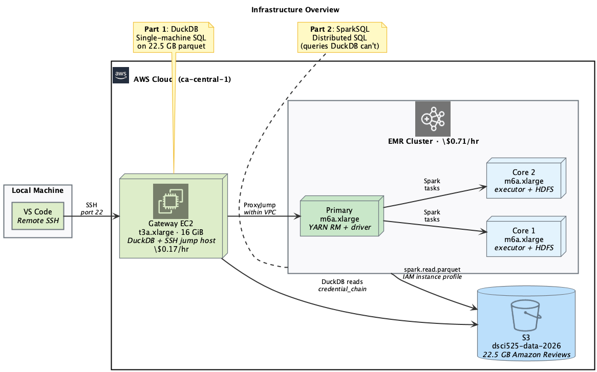
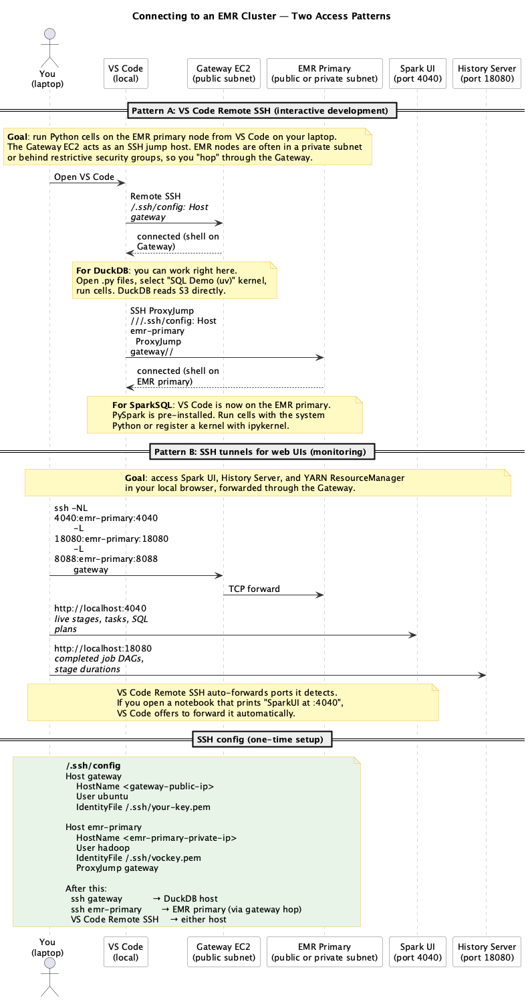

This page documents the AWS infrastructure behind Labs 2 and 4, and the live demo. If you want to reproduce these labs on your own AWS account after the course ends, this is your starting point.

::: {.callout-warning icon="false" title="Cost estimate"}

| Resource | Purpose | Cost |
|---|---|---|
| EC2 t3a.xlarge (16 GB) | DuckDB host + gateway | \$0.17/hr |
| EMR 3-node m6a.xlarge | SparkSQL cluster | \$0.71/hr |
| S3 storage (22.5 GB) | Amazon Reviews dataset | \$0.52/month |
| EBS gp3 32 GB (per node) | Instance storage | \$2.56/month each |

**Typical 2-hour session**: \$1.76 (EC2 + EMR). Terminate instances when done.
:::

## Architecture

{width=95%}

The setup has four components:

1. **VPC with public subnets** in `ca-central-1`. EMR and EC2 instances launch into these subnets with internet access via an Internet Gateway.

2. **Gateway EC2 instance** (`t3a.xlarge`): runs DuckDB for single-machine SQL and serves as an SSH jump host to reach the EMR cluster. Has an IAM instance profile (`ec2-s3-reader`) for S3 access.

3. **EMR cluster** (1 primary + 2 core nodes, `m6a.xlarge`): runs SparkSQL, MLlib, and optionally Trino. Uses the default EMR IAM roles for S3 access and log shipping.

4. **S3 bucket** (`dsci525-data-2026`): stores the Amazon Reviews dataset (22.5 GB hive-partitioned parquet), batch scripts, and EMR logs.

## Connecting to the cluster

{width=85%}

### Pattern A: VS Code Remote SSH

For interactive development (running Python cells, editing files):

1. Connect VS Code to the **Gateway EC2** via Remote SSH
2. For DuckDB work: you are already there. Open `.py` files, select the "SQL Demo (uv)" kernel, run cells.
3. For SparkSQL: use SSH ProxyJump to hop from the Gateway to the **EMR primary node**

Add to your `~/.ssh/config`:

```
Host gateway
    HostName <gateway-public-ip>
    User ubuntu
    IdentityFile ~/.ssh/your-key.pem

Host emr-primary
    HostName <emr-primary-private-ip>
    User hadoop
    IdentityFile ~/.ssh/vockey.pem
    ProxyJump gateway
```

Then `ssh gateway` or `ssh emr-primary` from your terminal, and VS Code can connect to either host.

### Pattern B: SSH tunnels for web UIs

For monitoring (Spark UI, History Server, YARN):

```bash
ssh -NL 4040:emr-primary:4040 \
    -L 18080:emr-primary:18080 \
    -L 8088:emr-primary:8088 \
    gateway
```

Then open in your browser:

| URL | What it shows | When to use |
|---|---|---|
| `http://localhost:4040` | Spark UI (live stages, tasks, SQL plans) | While a Spark job is running |
| `http://localhost:18080` | History Server (completed job DAGs) | After a job finishes |
| `http://localhost:8088` | YARN ResourceManager (cluster resources) | Cluster-level monitoring |

VS Code Remote SSH auto-forwards ports it detects: if your notebook prints a URL with `:4040`, VS Code offers to forward it automatically.

## Demo scripts

The `demos/sql-on-cluster/` directory contains the live demo scripts:

| Script | Engine | What it shows |
|---|---|---|
| `01_duckdb_s3.py` | DuckDB | S3 credential chain, streaming queries, hive partitioning |
| `02_duckdb_limits.py` | DuckDB | Hash table memory pressure, intentional OOM |
| `03_spark_sql.py` | SparkSQL | Same queries distributed, 50M-user GROUP BY |
| `04_spark_ml.py` | SparkSQL + MLlib | Feature engineering chained with model training |
| `05_spark_fail.py` | SparkSQL | Intentional failures, log reading guide |

See `demos/sql-on-cluster/DEMO_FLOW.md` for the instructor's run sheet with timing and talking points.

**Textbook chapters**: [SQL on the Cluster](https://pages.github.ubc.ca/mds-2025-26/DSCI_525_web-cloud-comp_book/lectures/w4c_sql_on_cluster.html), [Observing Your Spark Cluster](https://pages.github.ubc.ca/mds-2025-26/DSCI_525_web-cloud-comp_book/lectures/w4a_spark_debugging.html)

## Infrastructure scripts

The `infra/` directory has shell scripts for managing AWS resources:

| Script | What it does |
|---|---|
| `create_gateway.sh` | Launch Gateway EC2 (t3a.xlarge, instance profile, public IP) |
| `create_spark_cluster.sh` | Create an interactive 3-node EMR cluster with Spark |
| `transient_step.sh` | Submit a batch job on a transient cluster (auto-terminates) |
| `batch_user_summary.py` | PySpark script for the transient step |
| `create_trino_cluster.sh` | Create a dedicated Trino cluster (stretch goal) |
| `make_data_public.sh` | Make the Amazon Reviews S3 prefix publicly readable |

All scripts auto-discover public subnets in the account and print the cluster ID, SSH commands, and termination command.

::: {.callout-note collapse="true" title="Reproducing from scratch on your own account"}

If you want to rebuild everything on a fresh AWS account:

**TODO**: full setup scripts are planned. For now, the manual steps:

1. **Create a VPC** with two public subnets in different AZs, an Internet Gateway, and a route table. Tag the subnets with "public" in their name so the EMR scripts can auto-discover them.

2. **Create an S3 bucket** and upload the Amazon Reviews dataset as hive-partitioned parquet. Or use the public data at `s3://dsci525-data-2026/amazon_reviews/`.

3. **Create EMR default roles**: `aws emr create-default-roles --profile <your-profile> --region <your-region>`

4. **Create an EC2 instance profile** (`ec2-s3-reader`) with `s3:GetObject` and `s3:ListBucket` on your data bucket. Attach it to your Gateway EC2.

5. **Create a key pair** and download the `.pem` file.

6. **Launch the Gateway EC2** (t3a.xlarge, Ubuntu, your key pair, public subnet, instance profile attached). Clone this repo and run `demos/sql-on-cluster/setup.sh`.

7. **Launch the EMR cluster** using `infra/create_spark_cluster.sh` (update PROFILE, KEY_NAME).

Cost scripts and full automation are on the roadmap.
:::
