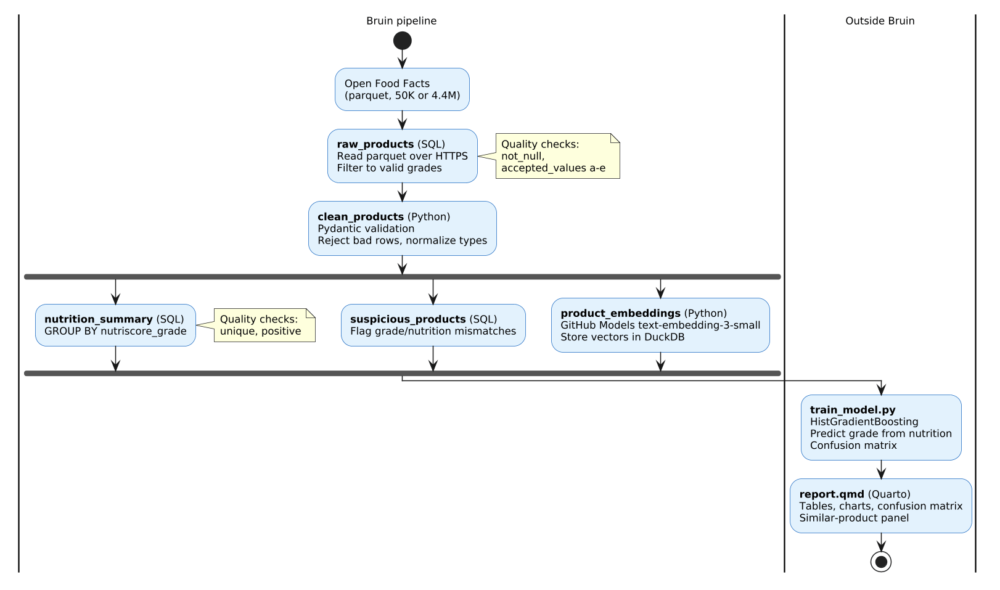

::: {.callout-warning icon="false" title="Cloud Economy"}
**Cost**: \$0 locally (DuckDB + GitHub Models free tier).

**Prerequisites**: everything from Labs 1-3 (Bruin, DuckDB, uv, GitHub token).

**Optional**: run on EC2 for the full dataset (~\$0.50 for a 2-hour session on t3a.small).

**Time**: 2-3 hours.
:::

## Advance organizer

**You already know** how to build a Bruin pipeline (Lab 1), query data on EC2 (Lab 2), and embed text with the GitHub Models API (Lab 3). In the course milestones you built a pipeline end-to-end but each milestone was a separate step.

**In this project** you chain everything into a single deliverable: a Bruin pipeline ingests and validates data, DuckDB computes summaries, embeddings add text-based similarity, a HistGradientBoosting model predicts nutrition grades, and a Quarto report presents it all. This is what a capstone pipeline looks like.


::: {.callout-note title="What you're practicing"}
**Skills**: multi-asset data pipelines with SQL and Python steps, Pydantic data validation, HistGradientBoosting classification, embedding-based similarity, Quarto report generation.

**From the textbook**: [Data Pipelines](https://pages.github.ubc.ca/mds-2025-26/DSCI_525_web-cloud-comp_book/lectures/w4_pipelines.html) (pipeline concepts, quality checks), [FastAPI on EC2](https://pages.github.ubc.ca/mds-2025-26/DSCI_525_web-cloud-comp_book/lectures/w4b_model_deployment.html) (model training pattern), [REST APIs](https://pages.github.ubc.ca/mds-2025-26/DSCI_525_web-cloud-comp_book/lectures/l1a_rest_api.html) (API calls for embeddings), [File Formats](https://pages.github.ubc.ca/mds-2025-26/DSCI_525_web-cloud-comp_book/lectures/l2a_file_formats.html) (parquet I/O)

**Why practice opportunities matter**: capstone projects require chaining multiple steps into a coherent deliverable. This is a dry run at capstone scale: messy input data, validation, analysis, ML, and a report someone could actually read. Building it end-to-end builds confidence that you can do it again with different data and a different question.
:::

## Overview

{width=85%}

## The pipeline

The project lives in `project-food-report/`. It is a Bruin project with 5 assets forming a DAG.

Run it:

```bash
cd project-food-report
bruin run --config-file .bruin.yml pipeline.yml
```

### Asset 1: Load and filter (`assets/raw_products.sql`)

A **SQL asset** that reads the food parquet over HTTPS, filters to valid nutriscore grades, and runs quality checks (`not_null`, `accepted_values` a-e) before anything downstream starts. This is the entry point.

### Asset 2: Pydantic validation (`assets/ingest_products.py`)

A **Python asset** that depends on `raw_products`. The Pydantic model defines what "clean data" means at the field level:

```python
# TODO: Complete the Pydantic model
class Product(BaseModel):
    code: str
    product_name_en: str
    nutriscore_grade: Literal["a", "b", "c", "d", "e"]
    energy_kcal_100g: float = Field(ge=0, le=5000)
    sugars_100g: float = Field(ge=0)
    proteins_100g: float = Field(ge=0)
    # ... add remaining fields
```

Rows that fail validation are logged and skipped. This is data validation at 2 levels: SQL quality checks on the raw table, then Python type checks on each row.

### Asset 3: Nutrition summary (`assets/nutrition_summary.sql`)

```sql
-- Provided: works immediately after ingest
SELECT
    nutriscore_grade,
    COUNT(*) AS n_products,
    ROUND(AVG(energy_kcal_100g), 1) AS avg_kcal,
    ROUND(AVG(sugars_100g), 2) AS avg_sugar,
    ROUND(AVG(proteins_100g), 2) AS avg_protein
FROM clean_products
GROUP BY nutriscore_grade
ORDER BY nutriscore_grade
```

### Asset 4: Suspicious products (`assets/suspicious_products.sql`)

```sql
-- TODO: find products where the grade doesn't match the numbers
-- Hint: grade 'a' but sugars_100g > 20, or grade 'e' but energy_kcal_100g < 100
```

### Asset 5: Embed products (`assets/embed_products.py`)

Uses the same pattern from Lab 3, but integrated as a Bruin asset.

```python
# TODO: embed product_name_en for the first 2000 products
# Store in a table with columns: code, product_name_en, embedding
```

### Model training (`train_model.py`)

Not a Bruin asset (runs separately after the pipeline). Uses the clean data to train a model:

```python
from sklearn.ensemble import HistGradientBoostingClassifier

# TODO: load features from DuckDB, train, evaluate
# Features: energy_kcal_100g, fat_100g, saturated_fat_100g,
#           carbohydrates_100g, sugars_100g, proteins_100g,
#           salt_100g, fiber_100g
# Target: nutriscore_grade
```

::: {.callout-tip collapse="true" title="Why HistGradientBoosting?"}
`HistGradientBoostingClassifier` is sklearn's built-in histogram-based gradient boosting. It is the same algorithm family as XGBoost and LightGBM: bin features into histograms, then grow trees greedily. The advantage: it is already in sklearn (no extra install), handles missing values natively, and runs fast on datasets up to ~1M rows. For this task it should achieve ~70-80% accuracy predicting nutriscore grade from numeric nutrition features.
:::

### Quarto report (`report/report.qmd`)

A template with placeholders. After running the pipeline and training:

```bash
cd project-food-report
quarto render report/report.qmd
```

The report includes:

- **Summary table**: nutrition averages by grade
- **Suspicious products**: flagged items with explanations
- **Confusion matrix**: model performance on held-out data
- **Similar products panel**: pick a product, show 5 nearest by embedding

## Scale and compare

### Batch 1 then batch 2

The pipeline reads the full 50K dataset by default. Change `raw_products.sql` to read `food_batch_1.parquet` (20K clean products), run the pipeline, train the model, and render the report. Then switch to `food_batch_2.parquet` (30K products with edge cases) and re-run everything.

Compare:

- How do `nutrition_summary` averages shift between batches?
- Does `suspicious_products` find more rows in batch 2? (It should: batch 2 includes grade-a products with high sugar.)
- Does model accuracy change when trained on cleaner vs messier data?

This is what production pipelines do: same code, new data, different results.

### Full dataset vs sample

Run the pipeline on the 50K sample (both batches combined). Then switch to the full 4.4M dataset:

1. **Predict**: how will ingest time, query time, and embedding time scale?
2. **Measure**: time each asset
3. **Explain**: which step scales worst? (Hint: embedding 4.4M products at 150 req/min would take ~days. What is the practical solution?)

::: {.callout-warning icon="false" title="Cloud Economy"}
**50K sample**: runs in ~5 minutes locally. Free.

**4.4M full dataset**: ingest and SQL assets run in ~2 minutes. Embedding all products is impractical on the free tier. Strategy: embed a representative sample (e.g., 10K products), train on all products using numeric features only.
:::

### Local vs EC2

Run the full pipeline locally, then on a t3a.small (2 GB RAM). Compare:

- Total pipeline time
- Memory usage during the GROUP BY on 4.4M rows
- Whether DuckDB needs `temp_directory` for spilling

## Extend

**Ideas:**

1. Add a Bruin quality check that verifies the confusion matrix accuracy exceeds a threshold (custom Python check).
2. Deploy the trained model as a [FastAPI endpoint](https://pages.github.ubc.ca/mds-2025-26/DSCI_525_web-cloud-comp_book/lectures/w4b_model_deployment.html) that accepts nutrition values and returns the predicted grade.
3. Schedule the pipeline with GitHub Actions to re-run weekly with fresh Open Food Facts data (see the [scheduling callout](https://pages.github.ubc.ca/mds-2025-26/DSCI_525_web-cloud-comp_book/lectures/w4_pipelines.html) in the Bruin chapter).
4. Add a second Quarto report comparing two time periods: is food getting healthier?
